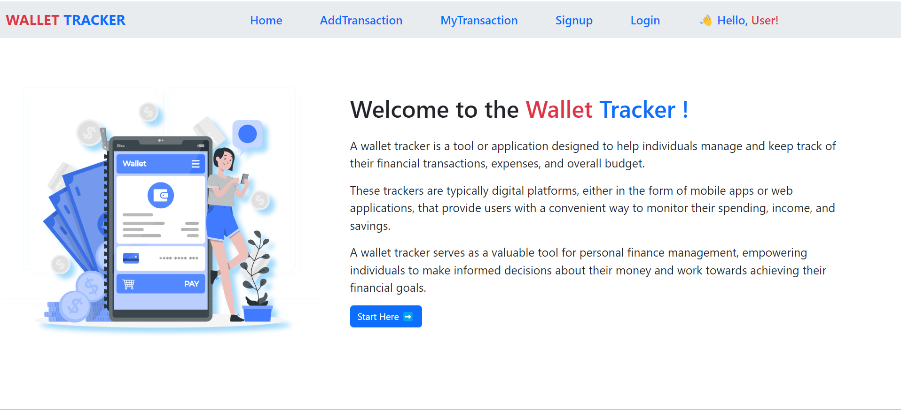

# Wallet Tracker

It is like a digital assistant for your money - helps you handle daily spending, income, and keep your budget in check. Users can easily add, update, or delete transactions. 

## Description
Wallet Tracker is a FullStack application! In frontend created with ReactJs , in backend i use ExpressJs, NodeJs, and to store data in MongoDB database.
